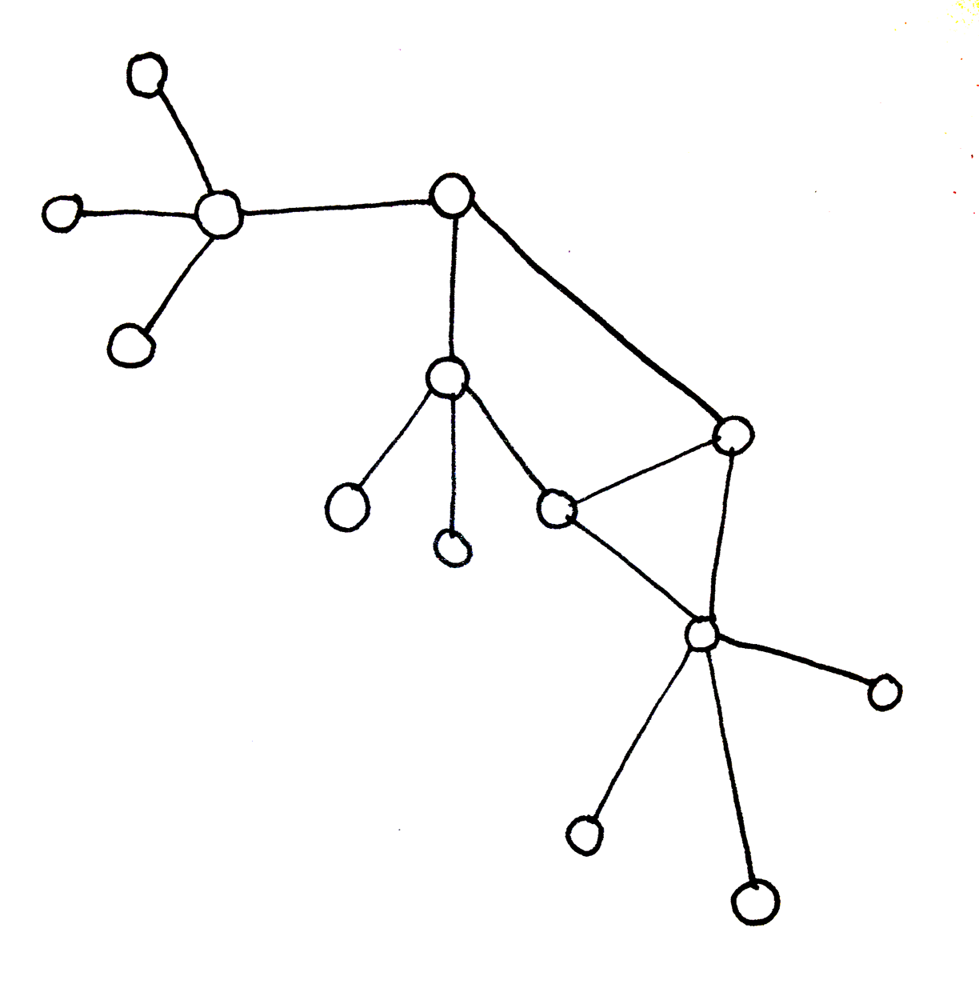
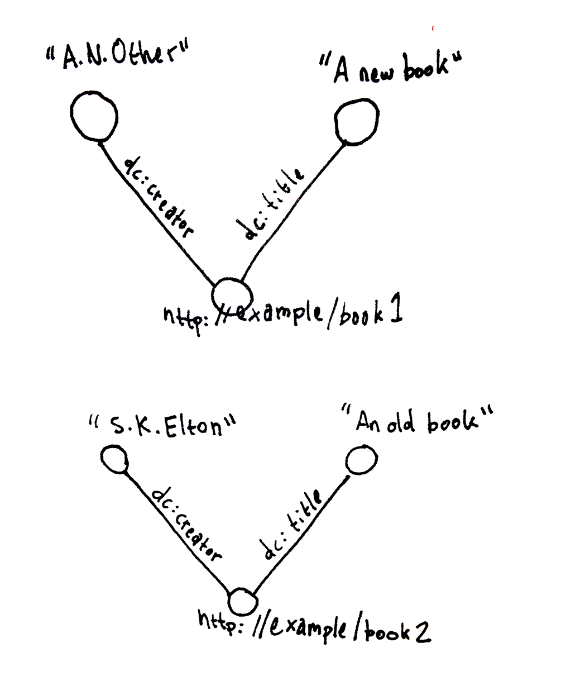

You're a researcher.
You have gathered lots of data. 
You want to store that data in a convenient place so it can be easily searched, analyzed, and repurposed by yourself, collaborators, and anonymous people the world over.
In other words you want to turn "data" into "open-linked data."
Great!  But there are some things you'll have to learn about the underlying technologies that have made open-linked data possible in the first place, graph databases in particular.
I believe the quicker you start playing with your own graph database the quicker you'll get a useful database out into the world.
So let's just jump in.

# Start Playing
There are many different graph database packages out there in the wild.
The one we'll be playing with is the Apache Foundation's, Jena.
Jena is the database itself, an implementation of the W3C's RDF ( Resource Description Framework) standard.
You interact with Jena through, a server called Fuseki.
The two come packaged together.
The names sometimes are used interchangably.

# Install Jena-Fuseki
I'm assuming you're using some flavor of Unix ( Linux or Mac OSX usually ) as your OS.

* <a href="http://jena.apache.org/download/index.cgi">Go to the downloads page</a>
* Click the binary distribution link "jena-fuseki-[version]-distribution.zip"
* If you know Unix the commands below should make sense.  If it looks like gibberish find a friend to help.
 
		mkdir -p /usr/local/fuseki
		cp jena-fuseki-1.0.1-distribution.zip /usr/local
		cd /usr/local
		unzip jena-fuseki-1.0.1-distribution.zip
		ln -s jena-fuseki-1.0.1 fuseki
		cd fuseki
		chmod +x fuseki-server s-**
		fuseki-server --update --mem /ds &

You now have a fuseki-server running on port 3030.

Fuseki uses the HTTP protocol to communicate with the outside world just like a webserver,
which means you can connect to it through your webbrowser.

* <a href="http://localhost:3030/">http://localhost:3030/</a>

# Your Playground
* Click 'Control Panel' link
* Click 'Select' button

So this page is where you can query the database and add new data.
This is your playground.

# Adding Data
Right now your database is empty.
Let's add some data using SPARQL-Update syntax.
Copy the text below into the SPARQL Update field and click 'Perform update'

	PREFIX dc: <http://purl.org/dc/elements/1.1/>
	INSERT DATA {
		<http://example/book1> dc:title    "A new book" ;
							   dc:creator  "A.N.Other" .
	}

So what's going on here?
Well we've added a unique identifier of a book **&lt;http://example/book1&gt;**.
This unique identifier is a URI, a Universal Resource Identifier.

We attached two bits of data to the book URI, title and creator.
The concept of "a title" and "a creator" have already been defined in another popular open-linked database 
so we can reuse them, **&lt;http://purl.org/dc/elements/1.1/title&gt;** **&lt;http://purl.org/dc/elements/1.1/creator&gt;**
Typing **&lt;http://purl.org/dc/elements/1.1/title&gt;** is cumbersome so we shortened it to dc:title.
We can only use these kinds of abbreviations if we explicitly declare what they are.
We do that at the very beginning with **PREFIX dc: &lt;http://purl.org/dc/elements/1.1/&gt;**

The specific title and creator attached to this book are just text not URIs, "A new book" and "A.N.Other".
Because they are just text they can't be attached to anything else.
Sometimes that's okay.
Sometimes it isn't.
With experience you'll learn when using text or URIs is appropriate.

There are other nuances to SPARQL-Update syntax displayed here... like, 
"What is up with the semi-colon and period?",
I'll explain them later. 
<a href="http://www.w3.org/Submission/SPARQL-Update/">Here's the document defining SPARQL Update syntax</a>.  

Let's add another book before we move on.

	PREFIX dc: <http://purl.org/dc/elements/1.1/>
	INSERT DATA {
		<http://example/book2> dc:title    "An old book" ;
							   dc:creator  "S.K.Eleton" .
	}

# Querying Data
So now you have some data in your database.
Now let's get it out of there.
We do that with the SPARQL Query Language.
Copy the text below into the SPARQL Query field and click 'Get Results'

	SELECT ?s ?p ?o 
	WHERE {
		?s ?p ?o
	}

This query will return all data in your database.
Luckily our total dataset is very small, so it runs quickly.
You should get output that looks like this...

	--------------------------------------------------------------------------------------
	| s                      | p                                         | o             |
	======================================================================================
	| <http://example/book2> | <http://purl.org/dc/elements/1.1/creator> | "S.K.Eleton"  |
	| <http://example/book2> | <http://purl.org/dc/elements/1.1/title>   | "An old book" |
	| <http://example/book1> | <http://purl.org/dc/elements/1.1/creator> | "A.N.Other"   |
	| <http://example/book1> | <http://purl.org/dc/elements/1.1/title>   | "A new book"  |
	--------------------------------------------------------------------------------------

Queries can use PREFIX just like update statements so you could issue a query like this one:

	PREFIX dc: <http://purl.org/dc/elements/1.1/>
	SELECT ?s ?p ?o 
	WHERE {
		?s ?p ?o
	}

The output changes as you'd expect.

	-------------------------------------------------------
	| s                      | p          | o             |
	=======================================================
	| <http://example/book2> | dc:creator | "S.K.Eleton"  |
	| <http://example/book2> | dc:title   | "An old book" |
	| <http://example/book1> | dc:creator | "A.N.Other"   |
	| <http://example/book1> | dc:title   | "A new book"  |
	-------------------------------------------------------

So how does the query work?
Data relationships in graph databases are defined by triples.
Triples are basically declarative sentences with one subject, one predicate, and one object.

You specify what bits of data you want to extract with this line.

	SELECT ?s ?p ?o 

If you only wanted the predicate and the object of a triple, because say you know exactly which book you want.
You could run a query without **?s** like this one.

	PREFIX dc: <http://purl.org/dc/elements/1.1/>
	SELECT ?p ?o 
	WHERE {
		<http://example/book1> ?p ?o
	}

Here's the output of that query

	-----------------------------
	| p          | o            |
	=============================
	| dc:creator | "A.N.Other"  |
	| dc:title   | "A new book" |
	-----------------------------

Now what if you only wanted the title of all books?
You could run this query...

	PREFIX dc: <http://purl.org/dc/elements/1.1/>
	SELECT ?s ?o 
	WHERE {
		?s dc:title ?o
	}

...and get these results.

	------------------------------------------
	| s                      | o             |
	==========================================
	| <http://example/book2> | "An old book" |
	| <http://example/book1> | "A new book"  |
	------------------------------------------

<a href="http://www.w3.org/TR/sparql11-query/">Here's the document defining SPARQL query syntax.</a>

# If You Want To Delete ALL Of Your Test Data
Copy the text below into the SPARQL Update field and click 'Perform update'.

	DELETE WHERE { ?s ?p ?o }

# 'Conceptual Map' aka 'Categorical Structure' aka 'Ontology'
Now begins the fun part.
Modelling YOUR data.

Maybe you have a lot of data already,
maybe you have a small sample of representative data, 
maybe you just have an idea of the kinds of data you'll be gathering.

In any case a database's categorical structure, its ontology, needs to be defined.

Developing an ontology is as much art as it is science.
So I'm going to develop an ontology and document the most important parts of my process to guide you along.

I'm interested in building a system for inventorying images and their metadata 
so that's the kind of database ontology I'll be developing.

# List
What sorts of data am I going to store?
I'll list them to start.

* URL to the image
* photograph or graphic?
* name
* caption
* width
* height
* dpi
* mime-type ( file type: jpeg, png, gif, etc... )
* date created
* time of day
* latitude
* longitude
* size
* model of camera used
* shutter speed
* aperture size
* digital or film?
* collections of images it belongs to
* person who made image
* what's depicted in the image?

I now have a starting point.

# Research Preexisting Ontologies
Also it's worth researching whether there are existing ontologies devised to describe portions of your data already.
The less you recreate the wheel and the more you use existing ontologies the more 'linked' your data will become.

	Hint: PREFIX statement URLs will often lead to a definition of the ontology.
	Put PREFIX URLs into your webbrowser and see where they lead.

# Grouping and Typing
My next step is to group like elements together and note the type of data of each element.
I will add items along the way if I realize I forgot something.

Right now I'm still exploring the relationships between the data and
I'm thinking about the values that I'll be storing.

# Notation
So once you know what bits of data you'll be storing you have to map the relationships between those bits.
The best notation system I know of for exploring relationships in an ontology is the ball and stick system.

	
	
A classic conceptual modelling tool

	
	
Label your nodes and connections

# A Quick Grouping And Typing In Outline Format
Once you have a clear idea of the relationships between your data you'll want to think about data types.
So now I'll represent the relationships between my nodes in a more abstract outline form with data-types.

* &lt;image&gt;
	* id
		* URL ( text )
		* name ( text )
	* user
		* &lt;user&gt;
	* storage
		* &lt;file-type&gt;
		* size [ megabytes ] ( float )
	* interpretation
		* &lt;image-type&gt;
		* &lt;caption&gt;
	* resolution
		* width [ pixels ] ( int )
		* height in [ pixels ] ( int )
		* dpi ( int )
	* time
		* created ( time )
	* location
		* latitude ( float )
		* longitude ( float )
	* technology
		* &lt;camera-model&gt;
		* shutter ( float )
		* aperture ( float )
		* exposure ( float )
	* permssions
		* &lt;copyright&gt;
	* grouping
		* &lt;collection&gt;
	
* &lt;user&gt;
	* id ( int )
	* name ( text )
	
* &lt;copyright&gt;
	* shortname ( text )
	* fullname ( text )
	* legalese ( text )
	
* &lt;caption&gt;
	* created ( time )
	* text ( text )
	* &lt;user&gt;

* &lt;camera-model&gt;
	* name ( text )
	* digital ( bool )

* &lt;image-type&gt;
	* name ( text )
	
* &lt;collection&gt;
	* name ( text )
	* created ( date )
	* summary ( text )

* &lt;sub-img&gt;
	* coords ( sequence of floats )
	* &lt;img&gt;
	* &lt;caption&gt;

# RDF datatypes -- "typed literals"
Here's some links for more details on RDF datatyping.

* <https://jena.apache.org/documentation/notes/typed-literals.html>
* <http://www.w3.org/TR/swbp-xsch-datatypes/>

## Available datatypes
The most commonly used:

* string
* int
* unsignedInt
* float 
* Boolean
* dateTime

And the rest:

long short byte double unsignedByte unsignedShort unsignedLong decimal integer nonPositiveInteger nonNegativeInteger positiveInteger negativeInteger normalizedString anyURI token Name QName language NMTOKEN ENTITIES NMTOKENS ENTITY ID NCName IDREF IDREFS NOTATION hexBinary base64Binary date time duration gDay gMonth gYear gYearMonth gMonthDay

# Convert Your "Paper Ontology" To "RDF"
So there's a couple of ways to do this.
As you're exploring it's probably best to write INSERT DATA statements.
Below are some examples.

## Insert Image Record
	PREFIX ex: <http://example/>
	INSERT DATA {
		ex:img1 ex:url "http://127.0.0.1/imgs/Aerial01.jpg";
				ex:name "Aerial Photograph".
	}

## Add A Collection
	PREFIX ex: <http://example/>
	INSERT DATA {
		ex:collection1 ex:name "Aerial Photographs";
					   ex:summary "A collection of Aerial Photographs".
	}

## Add Images To A Collection
	PREFIX ex: <http://example/>
	INSERT DATA {
		ex:collection1 ex:possesses ex:img1.
	}

Eventually you'll want to create a .ttl document to store all of your triples.

# .ttl ( Turtle ) Documents
* <http://www.w3.org/TeamSubmission/turtle/>

Turtle format allows you to write RDF triples as a compact plain-text file.
It's probably the easiest way to migrate your data to your Fuseki instance.
Here's an example.  It should look somewhat familiar.

	@base <http://example.org/> .
	@prefix rdf: <http://www.w3.org/1999/02/22-rdf-syntax-ns#> .
	@prefix rdfs: <http://www.w3.org/2000/01/rdf-schema#> .
	@prefix foaf: <http://xmlns.com/foaf/0.1/> .
	@prefix rel: <http://www.perceive.net/schemas/relationship/> .
	
	<#green-goblin>
	    rel:enemyOf <#spiderman> ;
	    a foaf:Person ;    # in the context of the Marvel universe
	    foaf:name "Green Goblin" .
	
	<#spiderman>
	    rel:enemyOf <#green-goblin> ;
	    a foaf:Person ;
	    foaf:name "Spiderman" .

Lots more examples here.

* <http://www.w3.org/TR/2014/REC-turtle-20140225/>

# Loading a .ttl Document Into Your Database

	cd /usr/local/fuseki
	s-put http://localhost:3030/ds/data default /path/to/your/ttl/file.ttl

# Putting Your Database To The Test
So your data needs to be put to the test early on in the process.
Define what subsets of data you need and what formats you'll need it in.
Start writing the queries sooner rather than later.
Do not wait until the ontology is "finalized".
The ontology and the necessary queries should be developed in tandem, 
because if your queries become extremely complicated or query performance is poor 
this may be a sign that your ontology needs revision.

## Revise, Revise, Revise
Keep revising your ontology and queries and keep track of these revisions.
Source control is your friend in this case.
I highly recommend learning how to use Git or some other source control system.

## Document As You Go
To have a truly useful database it needs to be documented.
And you need documentation in two flavors.

* Developer documentation.
* User documentation.

Important aspects to document are...

* The ontology itself ( OWL format )
* Systems for acquiring new data and vetting it
* The technical infrastructure of your hosting environment

It's all about eliminating barriers of entry to people who want to use your data and the people who will maintain and extend your systems.

# The final stretch
Once the ontology is defined a "production system" of the database needs to be created.
The production system should be load tested.
A security audit should be performed.
Then promote your database.

Get people using it.
Get feedback.
Revise, revise, and revise...

# Reference materials
* Language Codes
	* <http://www.loc.gov/standards/iso639-2/php/code_list.php>
		* SPARQL uses the W3C standard 'ISO 639-1 Code'
* Popular Existing Ontologies
	* <http://www.w3.org/TR/owl-time/> : Time
