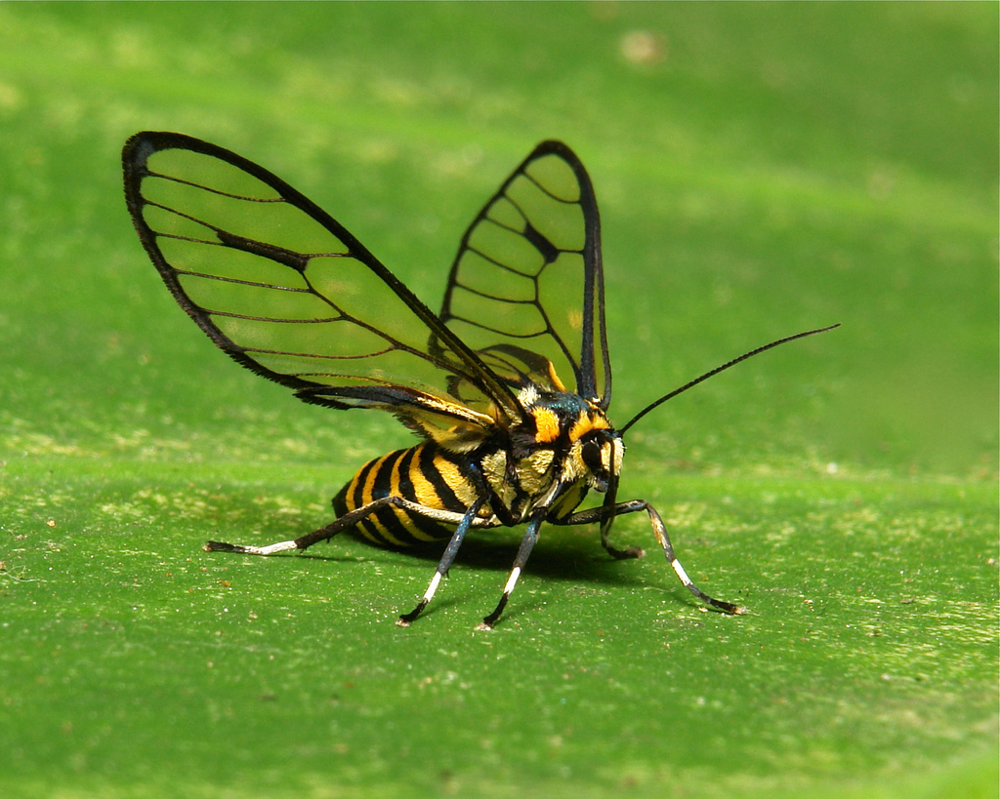

sputter coated?

"Sputter coating is where you place a specimen in a vacuum chamber, 
that has usually a gold/palladium alloy that gets bombarded with heavy gas atoms (usually argon) 
which makes sort of a beam of metal atoms that coat whatever is below them in a super thin layer of the metal. 
This coating looks a lot like the appearance of your beetle 
and it helps when you put your specimen into an SEM so it doesn't "charge" from the electron beam." 
http://www.reddit.com/r/Entomology/comments/1p1b7v/gold_flakes_more_in_comments/: Alchisme

###Massachusetts Insects and Spiders

* Ailanthus Webworm Moth
* American Bumble Bee
* American Carrion Beetle
* American Cockroach
* American House Spider
* American Lady Butterfly
* American Pelecinid Wasp
* Aphids
* Arrowhead Orb Weaver
* Arrow-shaped Micrathena Spider
* Asian Multicolored Lady Beetle
* Assassin Bug
* Augochlora Sweat Bee
* Bald-Faced Hornet
* Banded Garden Spider
* Bed Bug
* Big Dipper Firefly
* Black- and-Yellow Garden Spider
* Black Carpenter Ant
* Black Saddlebags Skimmer
* Black Swallowtail
* Black Vine Weevil
* Black-Legged Tick
* Blue Dasher
* Blue-fronted Dancer
* Bowl and Doily Weaver Spider
* Boxelder Bug
* Brown Mantidfly
* Brown Marmorated Stink Bug
* Buffalo Treehopper
* Cabbage White Butterfly
* Candy-striped Leafhopper
* Carolina Grasshopper
* Carolina Locust
* Carolina Mantis
* Checkered Beetle
* Cicada Killer
* Clouded Sulphur
* Coffinfly
* Comb-Clawed Spider
* Common Buckeye Butterfly
* Common Green Darner
* Common Thread Waisted Wasp
* Common Whitetail Skimmer
* Cottonwood Borer
* Cow Killer
* Cranefly
* Cuckoo Bee
* Differential Grasshopper
* Dobsonfly
* Dog Day Cicada
* Dogbane Leaf Beetle
* Eastern Carpenter Bee
* Eastern Eyed Click Beetle
* Eastern Harvestman
* Eastern Hercules Beetle
* Eastern Pondhawk
* Eastern Tent Caterpillar Moth
* Eastern Tiger Swallowtail
* European Earwig
* European Mantid
* Feather Legged Spider
* Field Cricket
* Fiery Skipper
* Firebrat
* Fishfly
* Five-Banded Tiphiid Wasp
* Forage Looper Moth
* Formica Ant
* Funnel-Web Spider
* German Cockroach
* Giant Leopard Moth
* Giant Mayfly
* Giant Stonefly
* Giant Swallowtail Butterfly
* Giant Water Bug
* Golden Northern Bumble Bee
* Goldenrod Crab Spider
* Grass Spider
* Gray Hairstreak Butterfly
* Great Blue Skimmer
* Green June Beetle
* Ground Crab Spider
* Hoary Edge Skipper
* Honey Bee
* Horntail Wasp
* House Centipede
* House Cricket
* Hover Fly
* Hummingbird Moth
* Ichneumon Wasp
* Ivory Marked Beetle
* Japanese Beetle
* Katydid
* Labyrinthine Orb Weaver Spider
* Lattice Orbweaver Spider
* Leaf-Footed Bug
* Locust Borer Beetle
* Long-bodied Cellar Spider
* Long-jawed Orb Weaver
* Long-legged Fly
* Long-legged Sac Spider
* Long-tailed Skipper
* Luna Moth
* Marbled Orb Weaver
* Mealy Bug Destroyer Larvae
* Metallic Crab Spider
* Milkweed Bug
* Monarch Butterfly
* Mydas Fly
* Net-Winged Beetle
* North American Jumping Spider
* Northern Mole Cricket
* Northern Walkingstick
* Notch Tipped Flower Longhorn Beetle
* Orb Weaver
* Pandorus Sphinx Moth
* Parson Spider
* Pearl Crescent Butterfly
* Periodical Cicada
* Pigeon Tremex
* Pipevine Swallowtail
* Planthopper
* Plume Moth
* Polyphemus Moth
* Potter Wasp
* Praying Mantis
* Predaceous Diving Beetle
* Pseudoscorpion
* Red Headed Ash Borer
* Red Oak Borer
* Ring-Legged Earwig
* Robber Fly (Diogmites)
* Robberfly (Promachus)
* Rose Chafer
* Rosy Apple Aphid
* Running Crab Spider
* Running Spider
* Saddleback Caterpillar
* Silverfish
* Silver-spotted Skipper
* Small Carpenter Bee
* Small House Fly
* Small-eyed Sphinx Moth
* Snow Mosquito
* Snowberry Clearwing Moth
* Soldier Beetle
* Southern Black Widow
* Sowbug Killer Spider
* Spicebush Swallowtail Butterfly
* Spined Micrathena Spider
* Spotted Camel Cricket
* Spotted Orb Weaver
* Squash Bug
* Stag Beetle
* Striped Blister Beetle
* Swamp Cicada
* Tachinid Fly
* Tan Jumping Spider
* Thin-Legged Wolf Spider
* Thread-Waisted Wasp
* Three Lined Potato Beetle
* Treehopper
* Triangulate Cob Web Spider
* Tuft-Legged Orb Weaver
* Varied Carpet Beetle
* Venusta Orchard Spider
* Vine Sphinx Moth
* Walkingstick
* Walnut Sphinx Moth
* Wasp Moth
* White Oak Borer Beetle
* White-lined Sphinx Moth
* White-spotted Sawyer Beetle
* Wolf Spider
* Woodland Jumping Spider
* Woolly Bear Caterpillar Moth
* Yellow Jacket
	* Latin: Vespula germanica
	* German Wasp
	

	
source <a href="http://eol.org/data_objects/25648719">eol.org</a>

	
	
Yellow Jacket

	
source <a href="http://eol.org/data_objects/25648717">eol.org</a>

	
	
Yellow Jacket Isolated

Insects of Concern: Emerald Ash Borer, Asian Longhorned Beetle, Winter Moth, Hemlock Wooly adelgid
Pathogens of Concern: Dutch Elm Disease

	
source <a href="http://i.imgur.com/apHao97.jpg">imgur.com</a>

	
	
Gold Flakes?

	
source <a href="http://www.flickr.com/photos/itchydogimages/10307777033/in/photostream">flickr.com</a>

	
	
Arctiid Wasp Moth (Arctiinae, Erebidae)

	
source <a href="http://io9.com/how-one-entomologist-used-grasshoppers-to-help-solve-a-1365026074">io9.com</a>

	
	
Grasshopper

