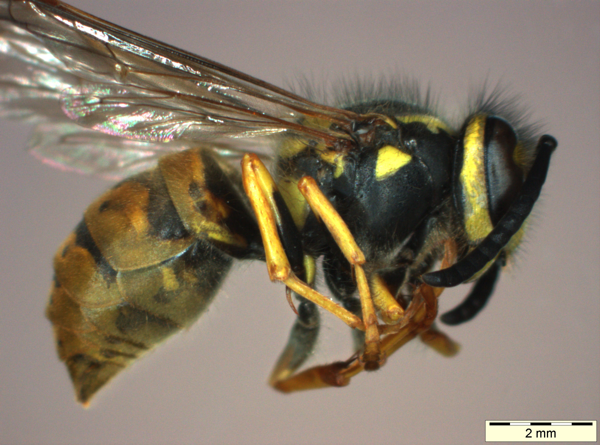

I decided to compile a list of insect and spider species that occur in the great state of Massachusetts, so I can better identitify them on my outdoor excursions and draw their interesting bits.  I'll be seeking out the best photographs of these species and useful information for finding them in their native habitat.  Also I can't help but go on tangents about art, architecture, civil planning, and society.  Be prepared for those.

I'll try to profile a different critter each week.

I'm not a professional biologist.  If you find any errors or if you know of good resources for this kind of information please get in contact with me.

Most of my information is compiled from <a href="http://eol.org">eol.org</a>.  If you want scientific rigor go there.  If you want eye-candy and some laughs stay here.

And now we begin...

* Ailanthus Webworm Moth

#Bumble Bees
###(Bombus)

* 00 - http://media.eol.org/content/2013/08/20/07/20284_orig.jpg
* 01 - http://media.eol.org/content/2013/08/20/07/20284_orig.jpg
* 02 - http://media.eol.org/content/2012/07/12/02/54503_orig.jpg

"The American bumble bee is a generalist feeder that forages on plants in the milkweed (Asclepiadaceae), composite (Asteraceae), forget-me-not (Boraginaceae), honey-suckle (Caprifoliaceae), morning-glory (Convolvulaceae), legume (Fabaceae), mint (Lamiaceae), blazing star (Primulaceae), rose (Rosaceae), snapdragon (Scrophulariaceae), and nightshade (Solanaceae) families." [ source: http://eol.org/pages/1065343/details ]

They'll pollinate your tomato plants.

You can also thank them for helping to pollinate Mexican agave plants used to make fine tequila.

"These bees visit the Alabama leather flower plants with great frequency resulting in a high single-visit seed set. In the Chihuahuan Desert, the American bumble bee is one of the main pollinators of lechuguilla (Agave lechuguilla) - an indicator species for the Chihuahuan Desert." [ source: http://eol.org/data_objects/13440340 ]

The American Bumble Bee is a very "hairy" bee. Is bumble bee "hair" made out of chitin?  Yes it is. Mammalian hair is made from keratin.

Are "hairier" bees more likely to be general pollinators than their smoother cousins?  Is smoothness in a pollinator an indicator of a specialized nectar diet, or in other words a preference for the nectar of particular flowers belonging to particular plant families?

Is bumble bee hair electrostatically charged?  It is...  This attracts pollen grains to the bee body like a magnet.

Barbed tails mean that these bees will die post sting.

#Honey Bee
###(Apis)

Honey bees are fascinating.  I could gab about them for hours, and I will... if you're a very slow reader.

First of all they are so organized that Martha Stewart is envious.  They have division of labor.  There's royalty of course, the queen.  We all know her.  She's the one doted on by the rest of the hive because of her big fertile behind.  She's like Oprah except with children.

There are male gigolo bees who kind of just take it easy and ocassionally have sex with the queen.  You know that saying, "busy as a bee".  Well that doesn't really apply to these guys.

Don't let me mislead you by calling them gigolos.  Bee sex is not the hairier guy pumps from behind variety like most mammals enjoy.

We call these guys, and they are guys in the strictly biological sense, the drones.  Interesting fact about drones. Their eyes are twice as large as other bees.  They're the big dewey-eyed teenage heart-throbs of the honey bee world.  I've been guilty of using the word 

And finally there's a huge army of nameless female bees who are individually disposable and do most of the work maintaining the hive named aptly, the workers.  Sound familiar, ladies?

Bees can communciate directions to sources of food by gathering a group of bees into a circle and spinning around in a very organized pattern.  It's called their "waggle dance".  The amount and frequency of their spins are their turn-by-turn GPS directions, or if you prefer a sequence of vector coordinates, aka numbers indicating direction and distance, in relation to the sun.

Think about that for a second.  That's like telling your friends how to get to your favorite pizza place by breakdancing on a huge sundial.

Bees are kamikaze pilots.  To defend their hive they will sting animals with a barbed tail and have vital organs pulled out their backsides as reward for their selflessness and bravery.

We are dependent on them to pollinate most of our fruits and vegetables.  I'm sure some corporation, probably Monsanto, has is planning on filing a patent for using the kind of 'drones' getting a lot of press lately, aka RC helicopters driven by computers, to pollinate plants, because we're killing honey bees off in droves with industrial agricultural pollution.

What makes them truly amazing in my opinion is the homes they build.

Honey bee hives are constructed out of hexagonal cells, and are very efficient structures.
Perhaps the most efficient structures.

Why hexagaons and not squares you may be wondering...
Well checkout this video.

http://www.youtube.com/watch?v=dAyDi1aa40E

In wonder if city planners could make use of this information.  Why are we laying out city streets in grids with 90 degree angles instead of 120 degree angles?  What is our fascination with right angles?  They're very limiting.  Is it because of agriculture?  Are we so used to walking behind a plow in long straight lines that we decided to use them for our transportation networks?  How do we connect all these rows of straight lines?  Usually just with more straight lines.

Hexagonal streets would be great for pedestrians.  It's very unnatural to have structures reaching into the sky arranged on a perfect grid.  That doesn't happen in nature unless humans have intervened. You'll see trees growing in long straight lines in orchards, which I suppose make them easier to maintain and harvest.  But it isn't just efficiency, a row of trees helps mark personal property.  Somebody wandering through the publically owned woods who comes across rows of straight trees will know that they are now on someone's "personal property", and that foraging has now become stealing.  It's marking territory.  The man pushing a lawnmower in a grid over a useless grassy front lawn every Saturday morning is doing the same thing.  He has to let the neighbors know this is his residence, the place where he does the majority of his eating, sleeping, shitting, and fucking.

We use rectangles, cubes, and grids like this all the time.  What's a great painting without a frame?  Why it's incomplete.  When we give each other gifts we usually put them in boxes with right angles.  We wrap them up and put a little bow on them.

Deviations from the right angle trend are seen as *exotic*.  Chinese food containers and the rich white person equivalent are exceptions.

Gift bags have become popular these days.  Ever see a gift bag that looks like an amorphous sac?  I don't.  I see flimsy boxes with one side cut off.

The exchanging of right angles marks the exchange of property.  Imagine signing a mortgage contract on a circular piece of paper.  That would probably be unsettling.  How is one supposed to file a circle?

Tree growth in Nature is probably best modeled as circles radiating outwards until blocked by some ecological barrier a river, a rival tree species, or changes in soil.

There is something mechanical and lazy about using rectilinear grids. Its efficient for travel in an automobile.  It also makes directions easier to follow, but there are draw backs certainly. There are places that buck this trend. I live just outside of Boston, Massachusetts.

Barcelona has a neighborhood nicknamed L'Example where the corners of intersecting streets are chamfered producing octagonal mini-plazas.  It makes for more casual strolling.  The chamfered areas usually are home to outdoor seating for restaurants, parking spaces for delivery vehicles, or the occasional park bench.  Buildings on these corners are desired pieces of real-estate and are usually beautifully decorated in art-deco motifs.

* American Carrion Beetle
* American Cockroach
* American House Spider
* American Lady Butterfly
* American Pelecinid Wasp
* Aphids

# Arctiid Wasp Moth (Arctiinae, Erebidae)

	
source <a href="http://www.flickr.com/photos/itchydogimages/10307777033/in/photostream">flickr.com</a>

	
	
Arctiid Wasp Moth (Arctiinae, Erebidae)

* Arrowhead Orb Weaver
* Arrow-shaped Micrathena Spider
* Asian Multicolored Lady Beetle
* Assassin Bug

* Augochlora Sweat Bee
* Bald-Faced Hornet
* Banded Garden Spider
* Bed Bug
* Big Dipper Firefly
* Black- and-Yellow Garden Spider
* Black Carpenter Ant
* Black Saddlebags Skimmer
* Black Swallowtail
* Black Vine Weevil
* Black-Legged Tick
* Blue Dasher
* Blue-fronted Dancer
* Bowl and Doily Weaver Spider
* Boxelder Bug
* Brown Mantidfly
* Brown Marmorated Stink Bug
* Buffalo Treehopper
* Cabbage White Butterfly
* Candy-striped Leafhopper
* Carolina Grasshopper
* Carolina Locust
* Carolina Mantis
* Checkered Beetle
* Cicada Killer
* Clouded Sulphur
* Coffinfly
* Comb-Clawed Spider
* Common Buckeye Butterfly
* Common Green Darner
* Common Thread Waisted Wasp
* Common Whitetail Skimmer
* Cottonwood Borer
* Cow Killer
* Cranefly
* Cuckoo Bee
* Differential Grasshopper
* Dobsonfly
* Dog Day Cicada
* Dogbane Leaf Beetle
* Eastern Carpenter Bee
* Eastern Eyed Click Beetle
* Eastern Harvestman
* Eastern Hercules Beetle
* Eastern Pondhawk
* Eastern Tent Caterpillar Moth
* Eastern Tiger Swallowtail
* European Earwig
* European Mantid
* Feather Legged Spider
* Field Cricket
* Fiery Skipper
* Firebrat
* Fishfly
* Five-Banded Tiphiid Wasp
* Forage Looper Moth
* Formica Ant
* Funnel-Web Spider
* German Cockroach
* Giant Leopard Moth
* Giant Mayfly
* Giant Stonefly
* Giant Swallowtail Butterfly
* Giant Water Bug
* Golden Northern Bumble Bee
* Goldenrod Crab Spider
* Grass Spider
* Gray Hairstreak Butterfly
* Great Blue Skimmer
* Green June Beetle
* Ground Crab Spider
* Hoary Edge Skipper
* Honey Bee
* Horntail Wasp
* House Centipede
* House Cricket
* Hover Fly
* Hummingbird Moth
* Ichneumon Wasp
* Ivory Marked Beetle
* Japanese Beetle
* Katydid
* Labyrinthine Orb Weaver Spider
* Lattice Orbweaver Spider
* Leaf-Footed Bug
* Locust Borer Beetle
* Long-bodied Cellar Spider
* Long-jawed Orb Weaver
* Long-legged Fly
* Long-legged Sac Spider
* Long-tailed Skipper
* Luna Moth
* Marbled Orb Weaver
* Mealy Bug Destroyer Larvae
* Metallic Crab Spider
* Milkweed Bug
* Monarch Butterfly
* Mydas Fly
* Net-Winged Beetle
* North American Jumping Spider
* Northern Mole Cricket
* Northern Walkingstick
* Notch Tipped Flower Longhorn Beetle
* Orb Weaver
* Pandorus Sphinx Moth
* Parson Spider
* Pearl Crescent Butterfly
* Periodical Cicada
* Pigeon Tremex
* Pipevine Swallowtail
* Planthopper
* Plume Moth
* Polyphemus Moth
* Potter Wasp
* Praying Mantis
* Predaceous Diving Beetle
* Pseudoscorpion
* Red Headed Ash Borer
* Red Oak Borer
* Ring-Legged Earwig
* Robber Fly (Diogmites)
* Robberfly (Promachus)
* Rose Chafer
* Rosy Apple Aphid
* Running Crab Spider
* Running Spider
* Saddleback Caterpillar
* Silverfish
* Silver-spotted Skipper
* Small Carpenter Bee
* Small House Fly
* Small-eyed Sphinx Moth
* Snow Mosquito
* Snowberry Clearwing Moth
* Soldier Beetle
* Southern Black Widow
* Sowbug Killer Spider
* Spicebush Swallowtail Butterfly
* Spined Micrathena Spider
* Spotted Camel Cricket
* Spotted Orb Weaver
* Squash Bug
* Stag Beetle
* Striped Blister Beetle
* Swamp Cicada
* Tachinid Fly
* Tan Jumping Spider
* Thin-Legged Wolf Spider
* Thread-Waisted Wasp
* Three Lined Potato Beetle
* Treehopper
* Triangulate Cob Web Spider
* Tuft-Legged Orb Weaver
* Varied Carpet Beetle
* Venusta Orchard Spider
* Vine Sphinx Moth
* Walkingstick
* Walnut Sphinx Moth
* Wasp Moth
* White Oak Borer Beetle
* White-lined Sphinx Moth
* White-spotted Sawyer Beetle
* Wolf Spider
* Woodland Jumping Spider
* Woolly Bear Caterpillar Moth
* Yellow Jacket

* German Wasp
	* Latin: Vespula germanica
	

	
source <a href="http://eol.org/data_objects/25648719">eol.org</a>

	
	
Yellow Jacket

	
source <a href="http://eol.org/data_objects/25648717">eol.org</a>

	
	
Yellow Jacket Isolated

	
source <a href="http://eol.org/data_objects/25648749">eol.org</a>

	
	
Yellow Jacket Flight

	
source <a href="http://i.imgur.com/apHao97.jpg">imgur.com</a>

	
	
Gold Flakes?

	
source <a href="http://io9.com/how-one-entomologist-used-grasshoppers-to-help-solve-a-1365026074">io9.com</a>

	
	
Grasshopper

