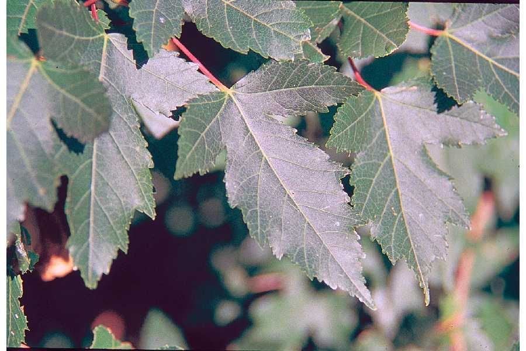
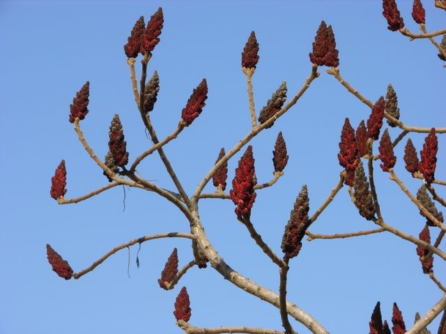
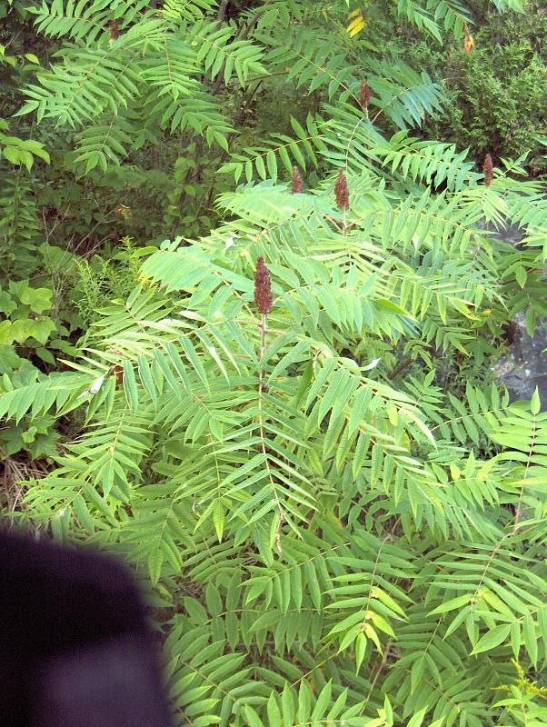
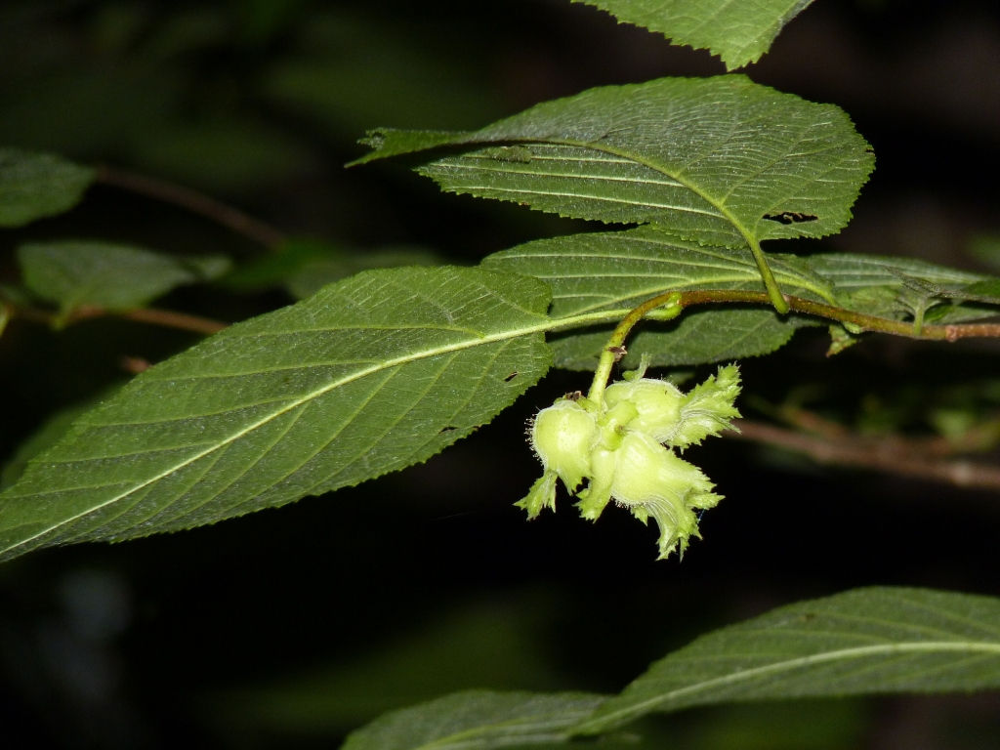
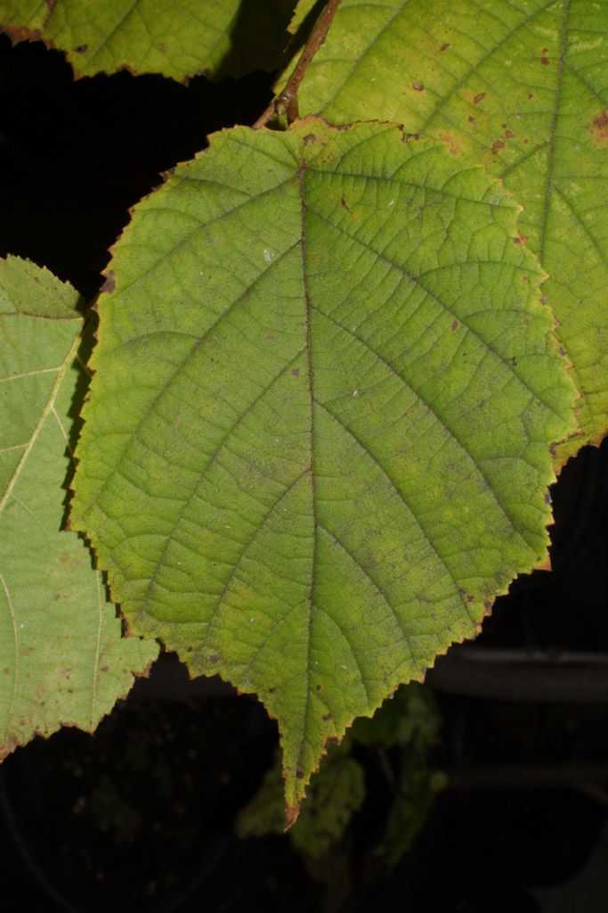

### Common Massachusetts Trees
* Acer, Maple 
	* The genus Acer (maples) includes approximately 125 species of trees 
	and shrubs distributed through Asia, North America, Europe, and 
	Northern Africa (van Geldren et al. 2010). The genus is characterized 
	by opposite, palmately lobed leaves, and a distinctive fruit, a samara, 
	formed of pair of nutlets with stiff, fibrous papery wings that aid in 
	wind dispersal.
	

	
source <a href="http://content61.eol.org/content/2012/07/15/05/93671_orig.jpg">eol.org</a>

	
	
Maple Samara

	
source <a href="http://content63.eol.org/content/2009/04/20/21/55743_orig.jpg">eol.org</a>

	
	
Maple Leaves

	
* Anacardiaceae Rhus, Sumac
	* Toxicodendron vernix, Poison Sumac
	* Rhus typhina, Staghorn Sumac

	
source <a href="http://content61.eol.org/content/2012/05/24/00/27497_orig.jpg">eol.org</a>

	
	
Staghorn Sumac Flowers

	
source <a href="http://content61.eol.org/content/2011/11/02/15/79251_orig.jpg">eol.org</a>

	
	
Staghorn Sumac Leaves

	
image by <a href="http://eol.org/data_objects/5822088">Tamara Horova</a>

	
	
Staghorn Sumac

* Betulaceae, Birch
* Betulaceae Betula, Birch    
* Betulaceae Carpinus, Hornbeam
* Betulaceae 
	* Corylus americana, Hazelnut
	

	
image by <a href="http://eol.org/data_objects/21951387">Steven J. Baskauf</a>

	
	
Hazelnut Pod

	
image by <a href="http://eol.org/data_objects/22513343">Rob Curtis</a>

	
	
Hazelnut Leaf Birth

	
image by <a href="http://eol.org/data_objects/22513345">Steven J. Baskauf</a>

	
	
Hazelnut Leaf

	
* Betulaceae Ostrya, Hophornbeam
* Bignoniaceae, Trumpet Creeper
* Caprifoliaceae, Honeysuckle
* Cornaceae, Dogwood
* Cornaceae Cornus, Dogwood
* Cornaceae Nyssa, Tupelo
* Cupressaceae, Cypress
* Cupressaceae Chamaecyparis, Cedar
* Cupressaceae Juniperus, Juniper
* Cupressaceae Thuja, Arborvitae
* Ebenaceae, Ebony
* Ebenaceae Diospyros, Persimmon
* Ericaceae, Heath
* Fabaceae, Pea
* Fabaceae Gleditsia, Locust
* Fagaceae, Beech
* Fagaceae Quercus, Oak
* Hamamelidaceae, Witch-hazel
* Juglandaceae, Walnut
* Juglandaceae Carya, Hickory
* Juglandaceae Juglans, Walnut
* Lauraceae, Laurel
* Magnoliaceae, Magnolia
* Moraceae, Mulberry
* Moraceae Morus, Mulberry
* Myricaceae, Bayberry
* Oleaceae, Olive
* Oleaceae Fraxinus, Ash 
* Pinaceae, Pinus
* Pinaceae Abies, Fir
* Pinaceae Pinus, Pine
* Platanaceae, Plane-tree
* Platanaceae Platanus, Sycamore
* Rosaceae, Rose
* Rosaceae Crataegus, Hawthorn
* Rubiaceae, Madder
* Rutaceae, Rue
* Salicaceae, Willow
* Salicaceae Populus, Cottonwood
* Salicaceae Salix, Willow
* Tiliaceae, Lindon
* Tiliaceae Tilia, Basswood
* Ulmaceae, Elm
* Ulmaceae Celtis, Hackberry
* Ulmaceae Ulmus, Elm