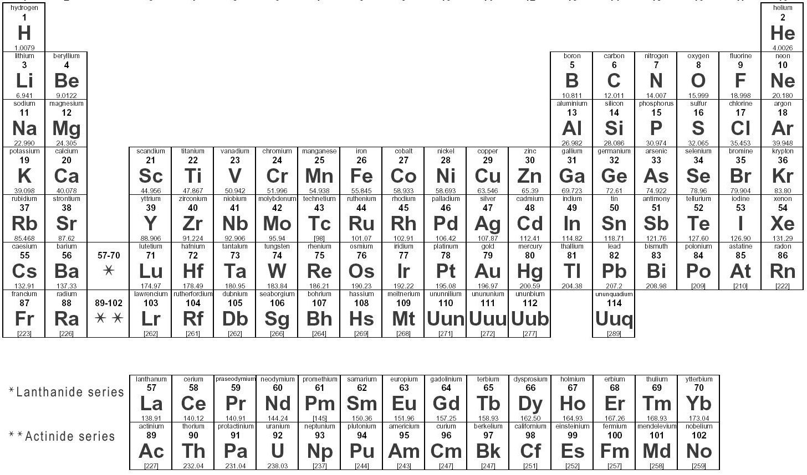
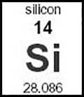

I've been working with triplestores and Ruby lately.
I've written some code which makes manipulating data triples with Ruby easy.
I want to share with you what I've learned, 
showing you the basics of building a Rails application with a triplestore backend.

# SparqlModel

If you've used Rails you've probably written model classes which use ActiveRecord.  SparqlModel is essentially code which replicates a lot of ActiveRecord's functionality but instead of interacting with a relational database using SQL it interacts with a triplestore using SPARQL.

# Background
If you are unfamiliar with triplestores, graph-databases, SPARQL, or RDF, you may want to read the following articles I've written.  
They explain the core concepts of triplestores, SPARQL, and graph databases in more detail than what I'll include here.

[ Graph Database Modelling ]( http://127.0.0.1/dot_com/story/gdb_modelling )

[ DBpedia ]( http://127.0.0.1/dot_com/story/dbpedia )

# Get ready
1. Install Ruby
2. Install Rails
3. Install Apache Fuseki
4. Install the sparql_model gem.
 
[ Grab SparqlModel here... ]( https://github.com/caesarfeta/sparql_model )

# The application
Let's make the periodic table of elements!

	
	
Nature's Pantry &amp; Refridgerator

# Define your model
We'll begin by defining a SparqlModel Element class.
Here's a close up of an element.

	
	
My vote for "Element of the Century!"

So here's a SparqlModel class where I define what kinds of data I need to model an element.

Here's a sample sparql_model class.

	class Element < SparqlModel
	  def initialize( _key=nil )
	    @endpoint = 'http://127.0.0.1:8080/ds'
	    @attributes = {
		  :symbol => [ "this:symbol", ::String, SINGLE, REQUIRED, UNIQUE, KEY ],
		  :name => [ "this:name", ::String, SINGLE, REQUIRED, UNIQUE ],
		  :number => [ "this:number", ::Integer, SINGLE, OPTIONAL, UNIQUE ],
		  :mass => [ "this:masss", ::Float, SINGLE, OPTIONAL ]
	    }
	    super( _key )
	  end
	end

# Your attention please!
So what's all this mean.

* @endpoint
	* The url to your sparql endpoint.
* @attributes
	* This is where you define your models attributes.  
	These correspond to "edges" in your graph-database, 
	or "predicates" in your RDF style triplestore.
	Toe-may-toe Toe-mah-toe, as far as SparqlModel is concerned.

Each item in @attributes is a key-value pair.  
The key has to be a symbol.  
The value has to be an array.
The items in this array are as follows.

* [0] is the RDF-triple predicate value ( :p )
* [1] is the data-type of the RDF-triple object value ( :o )
* [2] some RDF predicates should have only a SINGLE value, others should have MULTI values
* [3] --Optional-- some values are REQUIRED for a new instance to be created
* [4] --Optional-- some SINGLE values must be UNIQUE
* [5] --Optional-- marks the predicate as the KEY used by the get method.  KEY's must be UNIQUE.

You may be wondering what "this:" in "this:something" is all about.
I'll explain that in a bit.

# Use your model
Using your model is simple at this point.
Save it in the models directory of your Rails app.

	/path/to/rails/app/models/element.rb

Then fire up the Rails developer console and we can start messing around.

	cd /path/to/rails
	rails console development

Get an instance of Element.

	elem = Element.new

Create a new element.

	elem.create({ :name => "Silicon" })

Whoops that threw an error.

	RuntimeError: Required values missing ( symbol )

Looks like we have to pass the symbol value when we create an element.
Must be that REQUIRED attribute option.
Let's try this instead.

	 elem.create({ :name => "Silicon", :symbol=> "SI" })

Ahhh that works.

# Use your model some more...
What was the name of this element?  I forgot.

	elem.name

That's right, "Silicon".

Let's create a new element, Carbon.

	elem.create({ :name => "Crbon", :symbol => "C" })

Whoops... mispelled that.

	elem.name = "Carbon"

Ok fixed.  Carbon's atomic number is six.  So let's add that.

	elem.number = "six"

Another error... Oh of course I defined the :number attribute to use an ::Integer!  Duh!

	elem.number = 6

Interesting how Carbon's atomic number is six and it creates so many hexagonal shaped structures!  Benzene-rings and bucky-balls and all that.

Let's work on Silicon again.  We're getting Carbon distracted.

	elem.get("SI")

I can do that because I defined :symbol as my KEY attribute.

# Use your model some more... more...
So what info do I have on Silicon?

	elem.all

	{
		:urn=>"<urn:sparql_model:element.1>", 
		:edited=>1406129133, 
		:symbol=>"SI", 
		:name=>"Silicon", 
		:created=>1406129133, 
		:number=>"", 
		:mass=>""
	}

I have a :urn.  
That was created automatically.  
It's an internal unique identifier used by SparqlModel.  
It doesn't have to be the only one though.  
I'm using :symbol as a unique identifier right now.  
I could use :name too or create another attribute for storing a different URN and make that that the unique identifier if I wanted to. 
All I need is to set that attribute's UNIQUE and KEY configuration options.

I have :symbol and :name which I know about...

:edited and :created are timestamps which are created automatically.
:created is set when .create() is run.
:edited is set anytime a value is changed.

I haven't added filled out :number or :mass yet.  Let's do that in one shot.

	elem.change({ :number => 14, :mass => 28.086 })

Ahhh that's better.

	elem.all

	{
		:urn=>"<urn:sparql_model:element.1>", 
		:edited=>1406130770, 
		:mass=>28.086, 
		:number=>14, 
		:symbol=>"SI", 
		:name=>"Silicon", 
		:created=>1406129133
	}

# Using the model wrap-up
So that's basically the gist of using SparqlModel.
I find it easy to work with.
Hopefully you do too.

If you want to see what an element looks like in Fuseki, peep this...

[ Oh my God!  What have I done!! ]( http://127.0.0.1:8080/ds/query?query=select+%3Fs+%3Fp+%3Fo%0D%0Awhere+%7B+%3Fs+%3Fp+%3Fo+%7D&output=text&stylesheet=)

If that URL doesn't resolve correctly just tweak it to the host and port of your Fuseki server.

Look at all them triples!

# Controller methods
( TODO )
So your controller methods are the front-line of your web application.  
So let's set one up.

# Ruby HTTP client
( TODO )
I like using a Ruby HTTP client when testing my controller methods rather than a browser.  The reason for that is you can create tests with commands.  The reason is testing with code will give you a record of your testing.  You can keep that around for regression testing.

#  Javascript API
( TODO )
The beauty of SPARQL is that interaction with the triplestore is done over HTTP.  
Updates should be restricted. 
Queries should be accessible.
